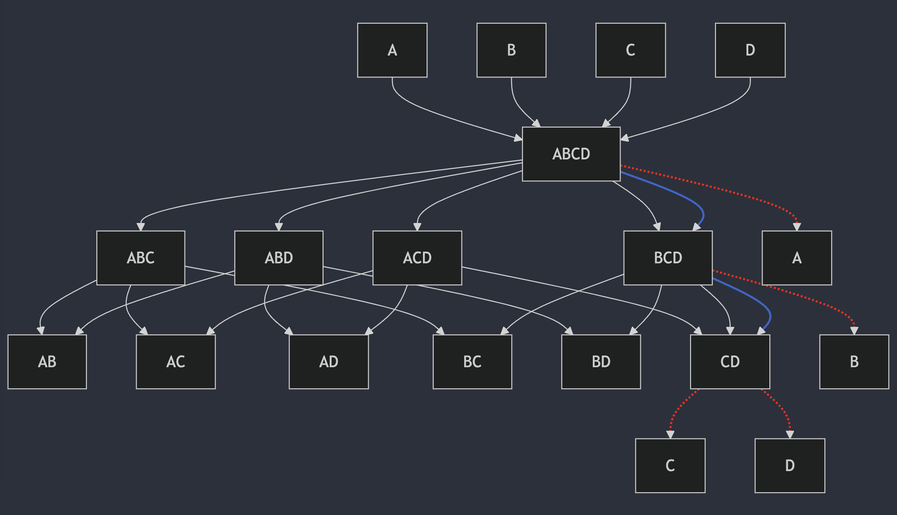
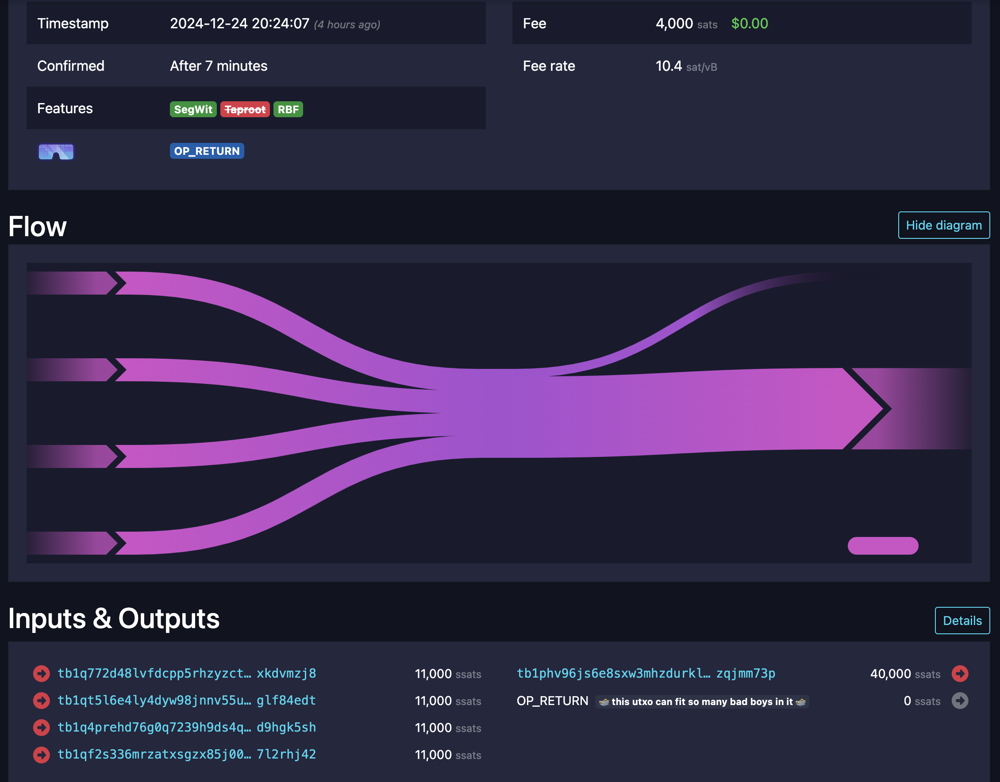
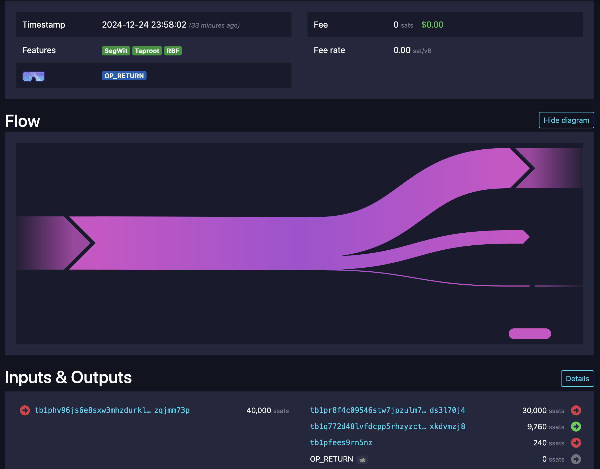
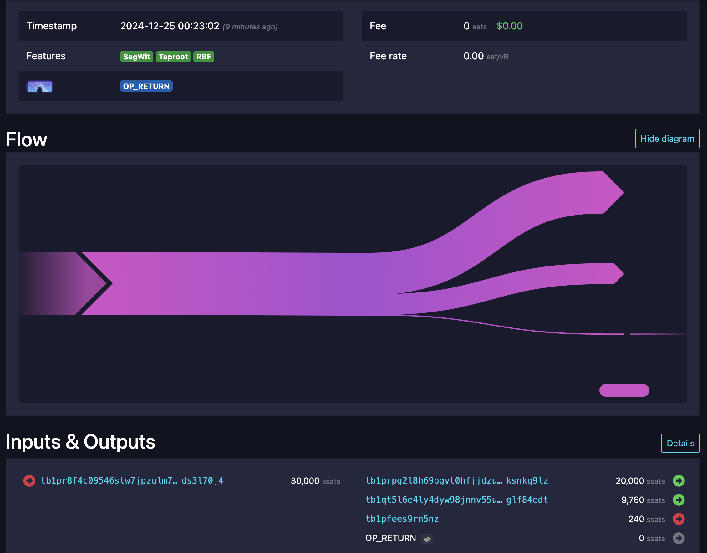
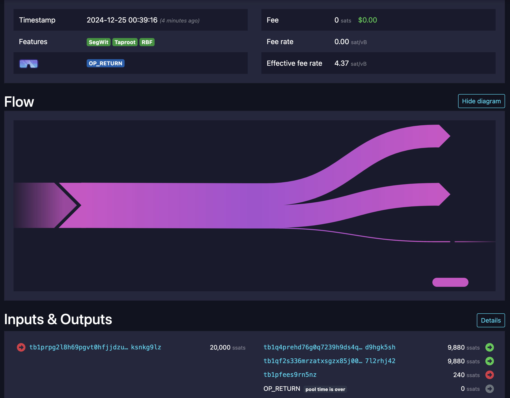

# ctv payment pool example

Here is a simple ctv payment pool example. Im not exactly sure what version of payment pools this is, but it just lets an n number of users share a utxo, and exit at any time they want, without having to coordinate with any of the other pool members.

It also incudes an example of how fee management could work when using CTV. You can test with p2a v3 transactions on regtest or v2 transactions with a hard coded fee provided for signet

I would have p2a on both networks but it takes a very long time to test as you have to wait for confirmations between each withdraw for v3 transactions

Here is some more info

Why Pool? https://rubin.io/bitcoin/2021/12/10/advent-13/
```
Pools are really great for a number of reasons. In particular, Payment Pools are fantastic for Scalability since they mean 1 utxo can serve many masters, and also each
txn only requires one signature to make a batched payment from a group. Payment Pools are kinda a killer version of a coin-join where you roll the funds from coinjoin to
coinjoin automatically5, giving you great privacy.
```

You can test spending any size pool by changing the following const. I got it to work with 21, but it took a very long time (43 mins, lol) to create all the different taproot spend combinations. It will spend in order of addresses added, just to keep it simple for the proof-of-concept.

```rust
const POOL_USERS: usize = 10;
```

I dont think i can create a big enough diagram for the 21 user pool so i will just show this 4 person pool



At each stage, any of the 4 users can leave if they havent left already. They can only withdraw what they deposited. The rest of the funds go to a new payment pool without the user who left.

## Example transactions for 4 person pool

funding transaction https://mempool.space/signet/tx/94590553a7998bed5e459c2df96454b2c1952d23a8315ed0f7e9868a3ec78448



first user exits https://mempool.space/signet/tx/5fa5342f5be158b5a7190ec57f8f1b53c0dac6cd03a4fc7e0f778686832f420a



second user exits https://mempool.space/signet/tx/e48378b6c2e43e2b81fa9421c048928aebe9abbdb65e74893e3324f28fa5e7ee



last two users exit https://mempool.space/signet/tx/ae01341817cf3bb7c04e7f02f0bd2c504a24fc24b9353f4d149c382543289740




## Example transactions for 10 person pool

You can follow the flow of exits from the first funding transaction to the last exit transaction

funding pool tx https://mempool.space/signet/tx/2940953ec49e40d07933fb573669f83df300d726d24158c8a793ef983a248467

final exit of pool tx https://mempool.space/signet/tx/9af0c632611ac4921ff6f02e3c073d9501791bfd7af856884dbecb8ab0c2f7da

## Setup

follow this guide to compile bitcoin (works for the inquisition fork) I will add a docker file or something to do this eventually

https://jonatack.github.io/articles/how-to-compile-bitcoin-core-and-run-the-tests

### install rust

```bash
curl --proto '=https' --tlsv1.2 -sSf https://sh.rustup.rs | sh
```

### Change pool size

for now you can set the pool size by changing this const. I will add cli stuff at some point to test spending different paths etc
```rust
const POOL_USERS: usize = 10;
```

### signet
```bash
./bitcoind -signet -addnode=inquisition.bitcoin-signet.net
```
```bash
export BITCOIN_RPC_USER="rpc_username"
export BITCOIN_RPC_PASS="rpc_password"
export SIGNET_WALLET="signet wallet name"
cargo run --no-default-features --features "signet"
```

### regtest

in regtest we use P2A and v3 transactions to spend. I had a hard time trying to get v3 transactions in to signet reliably, and you have to wait for confirmations so it takes forever to test.
```bash
./bitcoind -regtest -minrelaytxfee=0 -fallbackfee=0.0001
```
```bash
export BITCOIN_RPC_USER="rpc_username"
export BITCOIN_RPC_PASS="rpc_password"
cargo run --features "regtest"
```
### Resources

Thanks floppy for the help and examples https://x.com/1440000bytes/status/1821357538899611681

And thanks jeremy as always...

https://rubin.io/bitcoin/2021/12/10/advent-13/

https://rubin.io/bitcoin/2021/12/15/advent-18/

greg maxwell on IRC

https://freenode.irclog.whitequark.org/bitcoin-wizards/2019-05-21#24639752
